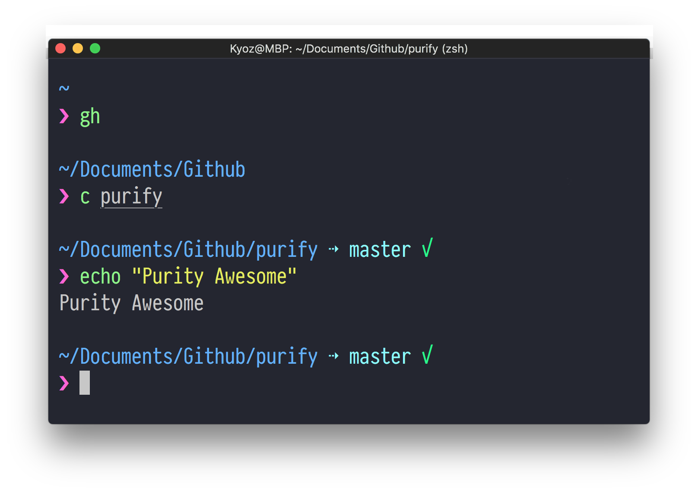

# purify

> oh-my-zsh theme

<p align="center">
  
</p>

## Install

```
$ git clone https://github.com/banminkyoz/purify.git
$ cd purify
$ cp purify.zsh-theme ~/.oh-my-zsh/themes/
```

## Usage

In your `.zshrc`, set `ZSH_THEME="purify"`.

Restart terminal and enjoy.

## Lisence
MIT © [Kyoz](mailto:banminkyoz@gmail.com)
