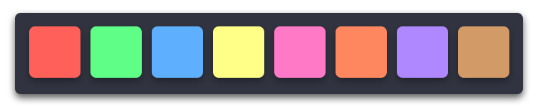
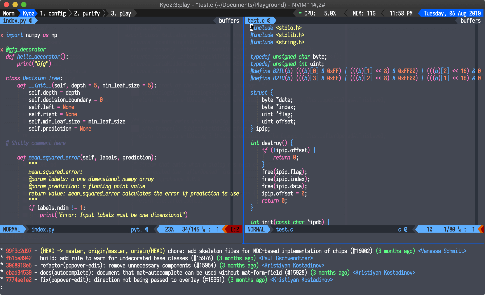

# purify

> Clean & vibrant color schemes for Vim, Terminals...

  

  

[Demo 2](https://raw.githubusercontent.com/kyoz/purify/master/demo/purify_demo_1.png)
[Demo 3](https://raw.githubusercontent.com/kyoz/purify/master/demo/purify_demo_2.png)
, Or you can view more demo images in [demo folder](./demo)

## Contents

- [Features](#features)
- [Todo](#todo)
- [Installation & Usage](#installation-&-usage)
- [References](#references)
- [Contributing](#contributing)
- [License](#license)

## Features
Purify support consistent color theme among terminals, editors and other things:

### Editors

- [x] [Vim, NeoVim, MacVim](./vim) (Come along with consistent colors of plugins, syntax of almost most popular programing languages...)

### Terminals

- [x] [Alacritty](./alacritty)
- [x] [Gnome Terminal](./gnome-terminal)
- [x] [iTerm2](./iterm2)
- [x] [Kitty](./kitty)
- [x] [st](./st)
- [x] [Terminal.app](./terminal-app) (OSX)
- [x] [XTerm, UXTerm, urxvt](./xterm)

### Others

- [x] [zsh](./zsh)

## Todo

I'll look into these terminals & editors when i have time. But mostly the time i'll use to maintain Vim and most used Terminal theme.

- [ ] Hyper
- [ ] fish
- [ ] termite
- [ ] tilix
- [ ] terminator
- [ ] emacs
- [ ] sublime
- [ ] vscode
- [ ] intelliJ

## Installation & Usage

Each editors, terminals and other things have seperate installation & usage guide. Just click in what you want to use in the [Features list](#features)

## References

In the demos i do use:

- [Iosevka font (free)](https://github.com/be5invis/Iosevka)
- [My neovim configuration](https://github.com/kyoz/neovim)
- [Quotes for cli](https://github.com/kyoz/iquotes-cli)

## Contributing

If you have any problem from install anything relate to Purify, or if you have any idea please [open an issue](https://github.com/kyoz/purify/issues/new)

Contributions are always welcome

## Lisence
MIT © [Kyoz](mailto:banminkyoz@gmail.com)
