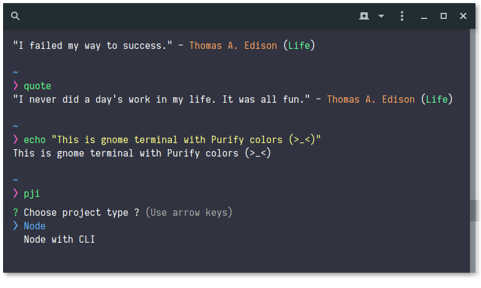

# Gnome Terminal
> Instruction to apply purify colors for gnome-terminal

## Demo

<p align="center">
  
</p>

## Installation

First you have to install `Purify` profile for gnome terminal. You can choose one of these ways:

```
# Install with wget
wget https://raw.githubusercontent.com/kyoz/purify/master/gnome-terminal/purify.sh -O - | sh

# Install with curl
curl -s https://raw.githubusercontent.com/kyoz/purify/master/gnome-terminal/purify.sh | bash -s

# Or you can download purify.sh file manually and run it with:
bash ./purify.sh
```

Then you can select `Purify` profile in `Preferences` (Restart terminal maybe required)

## To have padding in gnome terminal:

Create `gtk.css` file at `~/.config/gtk-3.0`

```
touch ~/.config/gtk-3.0/gtk.css
```

Open `gtk.css` and add these styles:
```
VteTerminal,
TerminalScreen,
vte-terminal {
  padding: 0px 0px 0px 16px;
  -VteTerminal-inner-border: 0px 0px 0px 16px;
}
```

## References

If you are using zsh, please take a look at [purify/zsh](https://github.com/kyoz/purify/tree/master/zsh) to get zsh config for purify.

## Lisence
MIT © [Kyoz](mailto:banminkyoz@gmail.com)
