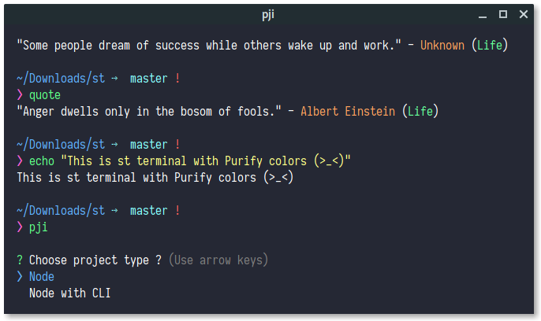

# st
> Instruction to apply purify colors for st terminal

<p align="center">
  
</p>

## Installation

In order to apply colors for st. You have to know [how to build st](https://git.suckless.org/st/file/README.html).

Edit those variables in `config.h` file and build st terminal like normal.

```c
static const char *colorname[] = {
  /* 8 normal colors */
  "#282C34", /* Black */
  "#FF6059", /* Red */
  "#5FFF87", /* Green */
  "#FFFF87", /* Yellow */
  "#5FAFFF", /* Blue */
  "#AF87FF", /* Magenta */
  "#5FAFFF", /* Cyan */
  "#FAFAFA", /* White */
  /* 8 bright colors */
  "#282C34", /* Black */
  "#FF6059", /* Red */
  "#5FFF87", /* Green */
  "#FFFF87", /* Yellow */
  "#5FAFFF", /* Blue */
  "#AF87FF", /* Magenta */
  "#5FAFFF", /* Cyan */
  "#FAFAFA", /* White */

  [255] = 0,

  /* more colors can be added after 255 to use with DefaultXX */
  "#FAFAFA", /* 256: Foreground */
  "#252834", /* 257: Background */
};

unsigned int defaultfg = 256;
unsigned int defaultbg = 257;
static unsigned int defaultcs = 257;
static unsigned int defaultrcs = 256;
```

## References

If you are using zsh, please take a look at [purify/zsh](https://github.com/kyoz/purify/tree/master/zsh) to get zsh config for purify.

## Lisence
MIT © [Kyoz](mailto:banminkyoz@gmail.com)
