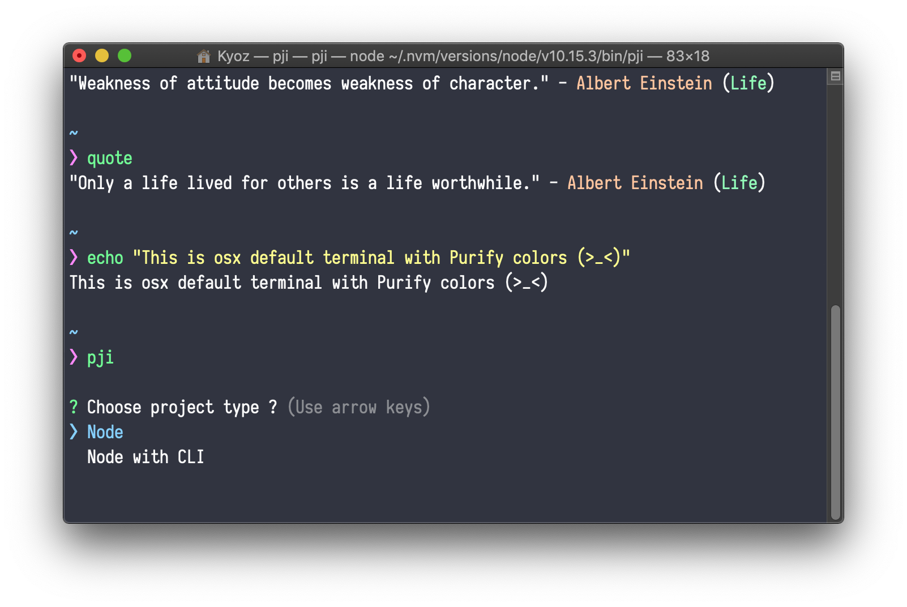

# Terminal app (OSX)
> Instruction to apply purify colors for OSX default terminal

## Demo

  

## Installation

Download and import `purify.terminal` to your OSX terminal

## References

If you are using zsh, please take a look at [purify/zsh](https://github.com/kyoz/purify/tree/master/zsh) to get zsh config for purify.

## Lisence
MIT © [Kyoz](mailto:banminkyoz@gmail.com)
