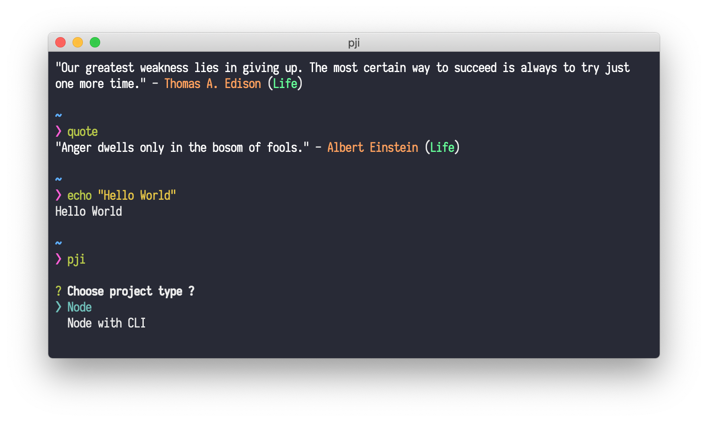

# ZSH

> oh-my-zsh theme

## Demo

### 1. OSX + Hyper

<p align="center">
  
</p>

### 2. OSX + Alacritty

<p align="center">
  
</p>

### 3. OSX + Iterm2

<p align="center">
  
</p>

### 4. Ubuntu + Hyper

<p align="center">
  
</p>

### 5. Ubuntu + Alacritty

<p align="center">
  
</p>

### 6. Ubuntu + Gnome Terminal

<p align="center">
  
</p>

## Installation

```
$ git clone https://github.com/banminkyoz/purify.git
$ cd purify
$ cp purify.zsh-theme ~/.oh-my-zsh/themes/
```

## Usage

In your `.zshrc`, set `ZSH_THEME="purify"`.

Restart terminal and enjoy.

## Tips

### In the demo screenshot, i do use:

* [Iosevka](https://github.com/be5invis/Iosevka) font (FREE)

* **OSX**:

  1. Hyper with [hyper-snazzy](https://github.com/sindresorhus/hyper-snazzy) theme
  2. Iterm2 with oh-my-zsh

* **Ubuntu**:

  3. Hyper with [hyper-snazzy](https://github.com/sindresorhus/hyper-snazzy) theme
  4. Gnome Terminal

You can get bash, git & oh-my-zsh configs, aliases... in [my dotfiles](https://github.com/banminkyoz/dotfiles)

### To have padding in gnome terminal (ubuntu)

Create `gtk.css` file at `~/.config/gtk-3.0`

```
touch ~/.config/gtk-3.0/gtk.css
```

Open `gtk.css` and add these styles:
```
VteTerminal,
TerminalScreen,
vte-terminal {
  padding: 0px 0px 0px 16px;
  -VteTerminal-inner-border: 0px 0px 0px 16px;
}
```

## References
* [CLI to get inspirational quotes](https://github.com/banminkyoz/iquotes-cli)
* [Init node project easily](https://github.com/banminkyoz/pji)
* [Bash colors & formating](https://misc.flogisoft.com/bash/tip_colors_and_formatting)
* [ASCII Art](https://textart4u.blogspot.com/2013/03/one-line-ascii-text-art.html)

## Lisence
MIT © [Kyoz](mailto:banminkyoz@gmail.com)
